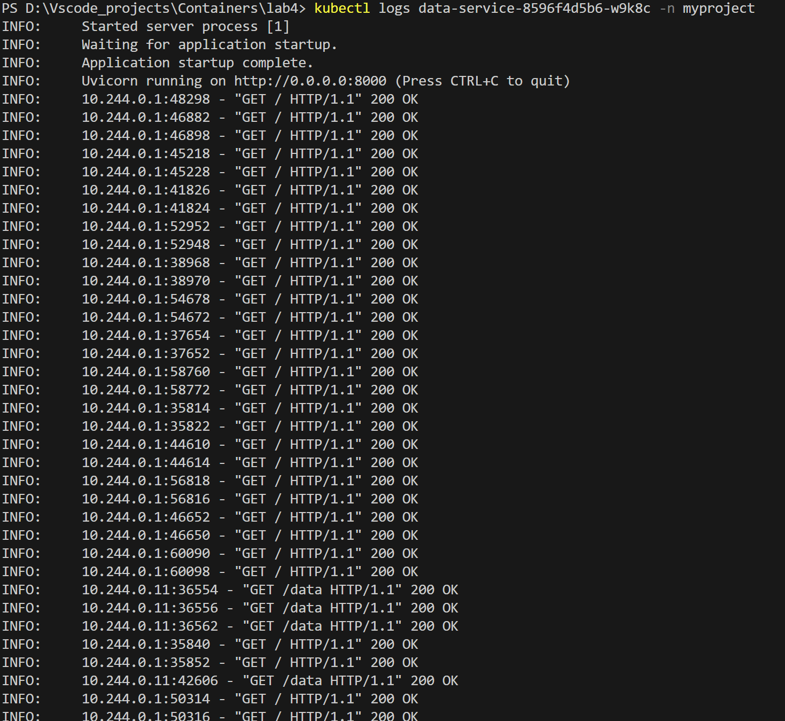
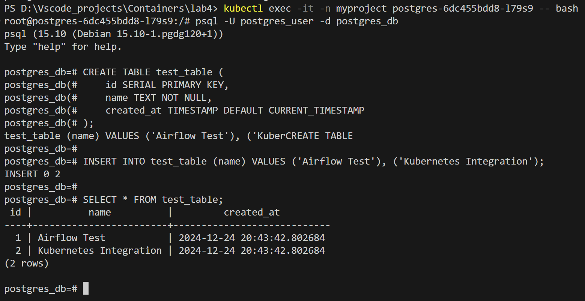

## Введение

В данной работе был создан и развернут проект, состоящий из следующих компонентов:

1. **Airflow** - система управления рабочими процессами.
2. **PostgreSQL** - база данных для хранения информации, полученной из дагов.
3. **Data-service** - сервис для предоставления данных через API.

Проект был развернут с использованием Kubernetes и локального окружения Minikube.

---

## Шаги выполнения

### 1. Настройка Minikube
- Запущен Minikube с помощью команды:
  ```bash
  minikube start
  ```
- Локальные директории для DAGs, логов и других данных были смонтированы в Minikube:
  ```bash
  minikube mount D:\Vscode_projects\Containers:/mnt/containers
  ```

### 2. Создание необходимых манифестов
- **Namespace:** Для изоляции проекта был создан namespace `myproject`.
- **ConfigMap и Secret:**
  - ConfigMap использовался для передачи конфигурационных данных, таких как параметры подключения к PostgreSQL.
  - Secret содержал чувствительную информацию, например, пароль для базы данных и API-ключи.
- **PersistentVolumeClaim:** Был создан PVC для хранения данных PostgreSQL.

### 3. Развертывание PostgreSQL
- Создан Deployment для базы данных PostgreSQL.
- Для PostgreSQL был настроен `PersistentVolumeClaim`, обеспечивающий постоянное хранение данных.
- Сервис PostgreSQL доступен внутри кластера через `ClusterIP`.

### 4. Развертывание Data-service
- Data-service был развернут как Deployment и настроен для связи с PostgreSQL через переменные окружения.
- Сервис был доступен через `NodePort` для внешнего подключения.

### 5. Развертывание Airflow
- Airflow был развернут с использованием LocalExecutor для параллельного выполнения задач.
- Были смонтированы директории для DAGs, логов и временных данных.
- Настроен Health-check через путь `/health`.
- Переменные окружения для подключения к PostgreSQL и другие параметры переданы через ConfigMap и Secret.

---

## Проверка работы

### 1. Интерфейс Airflow


Скрипт entrypoint.sh для airflow отрабатывает правильно, т.к. создается нужный юзер и запускается webserver.

### 2. Логи работы Data-service


### 3. Подключение к PostgreSQL

