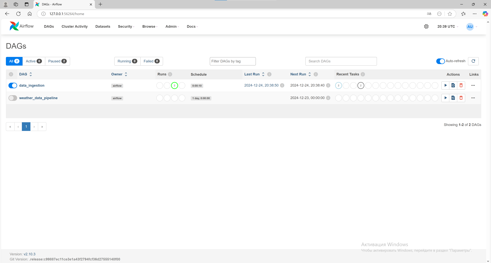

## 3 ЛР
### Запустил миникуб и проверил что он работает:

### Создал объекты из манифестов:

Все нашлось

### Сущности из nextcloud.yml успешно создались:

### Поды поднялись и работают:

## Далее к заданию
### Внесены нужные исправления в манифесты, nextcloud поднялся:

## Вопросы:
**Вопрос: важен ли порядок выполнения этих манифестов? Почему?**

Ответ: Да, потому что ооъекты некоторые объекты используют другие объекты, в моем случае конфигмапа нужна в деплойменте, а поды, которые создаются в деплойменте, нужны сервису

**Вопрос: что (и почему) произойдет, если отскейлить количество реплик postgres-deployment в 0, затем обратно в 1, после чего попробовать снова зайти на Nextcloud?**

Ответ: Не удается получить доступ к Nextcloud, так как после установки числа реплик PostgreSQL в 0 Kubernetes удалил все экземпляры базы данных. Это привело к потере данных, и при повторном подключении Nextcloud пытается обратиться к базе данных, которая уже не содержит нужной информации. При этом резервное копирование не выполнялось.